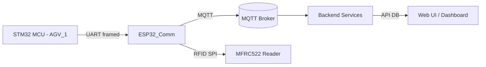

# Documentation & Architecture

This repository contains the low-level firmware for our AGV platform. It includes two main firmware projects:

- `AGV_1` — STM32 firmware for time-critical control, sensors, and motor control.
- `ESP32_Comm` — ESP32 firmware for networking, RFID, MQTT integration and coordination.

This document consolidates the technical details and architecture for the entire firmware repository, including build instructions, interfaces, protocols, and troubleshooting guidance.

---

## Table of contents

1. Overview
2. Repository structure
3. System architecture
4. Component technical details
   - STM32 (`AGV_1`)
   - ESP32 (`ESP32_Comm`)
5. Interfaces & Protocols
   - UART protocol (ESP32 ↔ STM32)
   - MQTT topics & payloads
6. Configuration & build
   - STM32 build notes
   - ESP32 (PlatformIO) build notes
   - Test harness
7. Debugging & troubleshooting
8. Known limitations & recommended improvements
9. Contribution guidelines
10. References

---

## 1. Overview

The firmware split separates responsibilities by real-time requirements:

- The STM32 (STM32F103C8T6 Blue Pill) handles all time-critical, sensor-driven control loops (line-following PID, motor PWM, ultrasonic timing, immediate safety responses).
- The ESP32 manages connectivity (Wi‑Fi, MQTT), RFID handling (MFRC522), higher-level order coordination, and acts as a bridge and telemetry forwarder to the backend.

This separation keeps real-time control on the MCU best suited for hard real-time tasks while enabling rich networked capabilities through the ESP32.

---

## 2. Repository structure

Top-level layout (relevant paths):

- `AGV_1/` — STM32 project (CubeMX/Eclipse/STM32CubeIDE structure)
  - `Core/Inc/` — headers
  - `Core/Src/` — source files (main.c, motor_control.c, Hcsr04.c, ESP32_comm.c, states_handling.c, etc.)
  - `Debug/`, `Drivers/` — build outputs and HAL drivers
  - `AGV_1.ioc` — CubeMX project
- `ESP32_Comm/` — PlatformIO-based ESP32 project
  - `include/` — `config.h`, `STM32_comm.h`, `RFID_reader.h`, etc.
  - `src/` — `main.cpp`, `network_manager.cpp`, `STM32_comm.cpp`, `RFID_reader.cpp`, `order_manager.cpp`
  - `platformio.ini`
  - `test_harness/` — test scripts (e.g. `test_mqtt_uart.py`)

See `AGV_1/README.md` and `ESP32_Comm/README.md` for per-component details.

---

## 3. System architecture

High-level components:

- STM32 (real-time control)
- ESP32 (networking, RFID, coordinator)
- MQTT Broker (backend or on-prem broker)
- Backend services (task assignment, telemetry, UI)
- Optional tools: test harness on a developer PC to simulate MQTT or UART

Mermaid diagram (component view):



Notes:
- UART carries control commands, acknowledgements and safety events between STM32 and ESP32.
- MQTT carries state telemetry, order updates, RFID events and backend-driven commands.

---

## 4. Component technical details

### STM32 — `AGV_1`

Scope:
- Real-time motor control and line-following PID.
- Sensor acquisition: line sensors, HC-SR04 ultrasonic, RFID trigger EXTI.
- UART receive for commands from ESP32.

Key modules and behavior:
- `Core/Src/main.c` — system init, non-blocking main loop, periodic scheduling.
- `Core/Src/motor_control.c` — PWM via TIM3, motor direction and braking logic.
- `Core/Src/Hcsr04.c` — non-blocking ultrasonic (TRIG pulse + TIM2 capture via EXTI), distance calculation.
- `Core/Src/states_handling.c` — AGV state machine and PID loop (called from AGV_Update()).
- `Core/Src/ESP32_comm.c` — UART ISR-driven receive, command queueing and parsing.

Additional recent STM32 behaviors (see `AGV_1/README.md` for details):
- Heartbeat LED toggles every 500 ms to indicate the system is alive (implemented in `main.c`).
- HC-SR04 trigger is scheduled from the main loop at ~100 ms intervals; echo timing still uses TIM2 + EXTI handlers (non-blocking).
- UART receive is interrupt-driven; `HAL_UART_RxCpltCallback()` forwards received bytes into the parser/queue and re-arms the RX interrupt for continuous reception.

Timing and real-time constraints:
- TIM2 configured as a 1 MHz counter for ultrasonic timing.
- HC-SR04 trigger is scheduled from the main loop (currently ~100 ms); the 10 µs trigger pulse is the only short blocking call.
- `AGV_Update()` performs PID and state-machine updates on a tight schedule; EXTI and TIM interrupts are used for time-sensitive sensor processing.

Hardware interfaces (high-level):
- TRIG/ECHO for HC-SR04 (GPIO/EXTI/TIM)
- Line sensors (ADC or digital inputs)
- UART1 configured for the ESP32 link (single-byte interrupt-driven RX)

Configuration notes:
- Ensure CubeMX sets ECHO EXTI on both rising/falling edges and TIM2 at 1 MHz.
- Keep the main loop non-blocking and defer long operations to other contexts.

### ESP32 — `ESP32_Comm`

Scope:
- Network connectivity (Wi‑Fi), MQTT client, RFID reader driver, order coordination, AGV identity generation, and UART bridge to STM32.

Key modules and behavior:
- `src/main.cpp` — Arduino `setup()` / `loop()` entry points, module initialization, event dispatch.
- `src/network_manager.cpp` — Wi‑Fi management, MQTT connection, publish/subscribe logic.
- `src/agv_identity.cpp` — generates the AGV serial, MQTT client ID, and topic names from the ESP32 MAC address.
- `src/STM32_comm.cpp` — UART framing implementation and packet transmission to STM32.
- `src/RFID_reader.cpp` — MFRC522 SPI integration and tag read handling.
- `src/order_manager.cpp` — local order lifecycle, tag-to-node traversal, and movement command selection.

Concurrency model:
- Arduino main loop plus callback-driven networking and polling-based RFID handling; this project does not create explicit application tasks.

Libraries & dependencies:
- `ArduinoJson` for JSON payloads
- `MFRC522` for RFID driver
- `PubSubClient` for MQTT (present in `libdeps/`)

Runtime behavior:
- `loop()` keeps Wi‑Fi and MQTT alive by calling `network.loop()`.
- MQTT callback data is stored in `network.incoming` and consumed by `main.cpp`.
- RFID is read from the MFRC522 when `USE_REAL_RFID = 1`; otherwise tag reads can be simulated from the `test/rfid` MQTT topic.
- `main.cpp` debounces the LOST and OBSTACLE digital inputs and publishes state updates immediately when the signal changes.
- `OrderManager` resolves tag UIDs using `include/tag_map_config.h`, updates the order state, and sends the next movement command to the STM32.
- UART sends fixed 3-byte command frames to STM32 from `sendMoveCommand()`.

Configuration notes:
- `include/config.h` centralizes Wi‑Fi credentials, MQTT broker settings, timing constants, and the `USE_REAL_RFID` switch.
- `include/agv_identity.h` / `src/agv_identity.cpp` generate `agvSerial`, `agvClientId`, and the MQTT topic strings from the ESP32 MAC address.
- `include/tag_map_config.h` defines the RFID UID to node mapping used by `OrderManager`.

---

## 5. Interfaces & Protocols

### 5.1 UART protocol (ESP32 ↔ STM32)

- Framed byte protocol (example from STM32 README): fixed 3-byte packets for some commands: `HEADER | CMD | CRC` where CRC can be XOR of header and cmd. Other, longer frames exist for richer payloads — see `include/STM32_comm.h` and `src/STM32_comm.cpp` for exact framing details and checksum algorithm.
- STM32 receives bytes in interrupt and reconstructs frames; valid commands are queued and consumed in `AGV_Update()`.

Implementation pointers:
- Match `baudrate`, `parity`, and `stop bits` between both devices (check `include/config.h` on ESP32 and the UART configuration generated by CubeMX on the STM32 side).
- STM32: UART receive uses `HAL_UART_RxCpltCallback()` which forwards bytes into the parser/queue and re-arms the RX interrupt; `AGV_Update()` consumes queued commands and transitions the FSM immediately on valid commands.
- FSM notes: PID is computed only in `AGV_STATE_FOLLOW_LINE`; rotation direction follows the last navigation command (left/right) instead of a fixed direction; `REACQUIRE_LINE` uses a position threshold to detect success (weighted sensor position).

### 5.2 MQTT topics and payloads

- Topics are generated dynamically from the ESP32 MAC address in `src/agv_identity.cpp`.
- The base topic format is `uagv/v2/<manufacturer>/<serial>/...`.
- Derived topics include `topicOrder`, `topicInstantActions`, `topicState`, and `topicConnection`.
- Typical payloads are JSON objects using `ArduinoJson`.
- Common messages:
  - `order` — order assignment and updates
  - `instantActions` — pause, resume, cancel, and state requests
  - `state` — AGV state updates
  - `connection` — retained connection status

Design guidance:
- Keep payloads small; include `timestamp`, `device_id`, `state`, and `sequence` where relevant.
- Implement idempotency where possible (replay protection via sequence numbers or timestamps).

---

## 6. Configuration & build

### STM32 build notes (`AGV_1`)

- Project is managed with STM32CubeIDE / Makefile outputs under `Debug/`.
- Open `AGV_1/AGV_1.ioc` in CubeMX/STM32CubeIDE to review clock, GPIO and peripheral configuration.
- Important checks:
  - TIM2 configured at 1 MHz for ultrasonic timing
  - EXTI configured for ECHO pin on both edges
  - UART settings consistent with ESP32

Build & flash using your toolchain (STM32CubeIDE or makefile). Example (CubeIDE): build and flash via the IDE or OpenOCD/ST-Link.

### ESP32 build notes (`ESP32_Comm`)

- Build and flash with PlatformIO. From `ESP32_Comm` folder:

```bash
pio run
pio run -t upload
pio device monitor -b 115200
```

- Ensure `include/config.h` contains correct Wi‑Fi credentials, MQTT broker address, timing constants, and the `USE_REAL_RFID` setting.

### Test harness

- `ESP32_Comm/test_harness/` contains `test_mqtt_uart.py` and `sample_order.json` to simulate MQTT and UART behavior.
- Quick test workflow:

```bash
python -m venv .venv
.venv\Scripts\activate
pip install -r ESP32_Comm/test_harness/requirements.txt
python ESP32_Comm/test_harness/test_mqtt_uart.py
```

---

## 7. Debugging & troubleshooting

- Use `pio device monitor` to inspect ESP32 logs and boot output.
- For STM32, use serial console or debug via ST-Link in CubeIDE. Check `Debug/` output if build artifacts are needed.
- Common failure modes:
  - MQTT connection failures: verify broker address, port, credentials, firewall/NAT rules.
  - UART framing errors: check baud rate, TTL/voltage levels, and wiring.
  - RFID misreads: confirm SPI wiring and power levels to MFRC522.

Quick checks:
- Confirm `include/config.h` values on ESP32.
- Confirm STM32 UART configuration in `Core/Src/usart.c` / CubeMX.
- Use temporary logging `Serial.println` / `printf` to trace flows in both firmwares.

---

## 8. Known limitations & recommended improvements

- MQTT client on ESP32 uses `PubSubClient` which has limited buffering; migrate to native ESP-IDF client for heavy loads.
- Offline persistence for orders is minimal — add persistent storage (SPIFFS or LittleFS) if needed.
- Safety events on STM32 are currently handled locally. The STM32 firmware will forcibly stop the AGV on obstacle detection and will automatically resume the previously requested motion when the obstacle clears (e.g., resume `FOLLOW_LINE` or `ROTATE` depending on the last command). For backend visibility, add explicit notifications from the ESP32.
- Consider adding authenticated, encrypted MQTT (TLS) for production deployments.

---

## 9. Contribution guidelines

- Make changes in the appropriate subproject (`AGV_1` or `ESP32_Comm`).
- Run local builds: STM32 via CubeIDE or `make`, ESP32 via PlatformIO.
- Add tests in `ESP32_Comm/test_harness/` for network and protocol changes.
- Document any hardware/pin changes in `include/config.h` and update this README.

---

## 10. References

- `AGV_1/README.md` — STM32 firmware specifics
- `ESP32_Comm/README.md` — ESP32 firmware specifics
- `ESP32_Comm/test_harness/` — test utilities
- PlatformIO documentation: https://platformio.org/
- STM32CubeIDE / CubeMX documentation: https://www.st.com/

---

